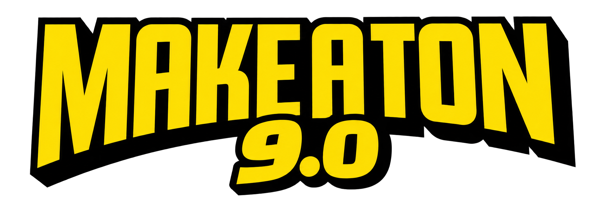

### ⚡ South India's largest **hiring** hackathon ⚡

**Build. Get noticed. Get the opportunity.**

 

---

# ⭐ THIS IS THE OFFICIAL WEBSITE OF MAKE-A-TON 9.0 ⭐

> **POW!** You've found the home page of **Make-A-Ton 9.0** — the official site for the
> ninth edition of the hackathon run by **CITTIC, CUSAT**, in collaboration with **Odoo India**.
>
> Everything about the event lives here: the story, the schedule, the stage, and the loot.

---

## 🗓 THE EVENT, IN ONE PANEL

|  |  |
|:--|:--|
| 🏁 **Registrations** | 21 September — 25 October 2026 |
| 💻 **Virtual Round** | 8 hours, online, open to all |
| 🎓 **HackForCUSAT** | 18 December 2026 · the CUSAT-only curtain raiser |
| 🔥 **The Grand Final** | 19 – 20 December 2026 · 24 non-stop hours |
| 📍 **The Arena** | CUSAT, Kochi, Kerala |
| 🤝 **Presented with** | Odoo India |

---

## 🏆 THE VICTORY LOOT

| 🥈 **SECOND PLACE** | 🏆 **CHAMPIONS** | 🥉 **THIRD PLACE** |
|:---:|:---:|:---:|
| **₹35,000** | **₹45,000** | **₹25,000** |

### 💰 ₹1,05,000 TOTAL PRIZE POOL

**Plus the real prize:** top performers get the opportunity to be considered for **hiring at Odoo.**

---

## 📖 WHAT'S INSIDE

<table>
<tr>
<td width="33%" valign="top">

### 🎬 The Hero
A comic page in print — sunburst title panel, a retro CRT that types itself, and a live countdown ticking down to the flag drop.

</td>
<td width="33%" valign="top">

### 📚 The Storybook
A scroll-driven, five-chapter comic that walks you through the journey from registration to the Kochi finale.

</td>
<td width="33%" valign="top">

### 🏅 The Podium
A fanned-out three-tier stage with spinning sunburst rays and prize counters that spin up as you arrive.

</td>
</tr>
<tr>
<td valign="top">

### 🟢 The Mascots
Ten hand-drawn characters peeking in from the edges — hover them, click them, and they'll talk back.

</td>
<td valign="top">

### 🕹 The Arcade
A hidden easter egg tucked behind the mascots, for when the countdown feels too slow.

</td>
<td valign="top">

### ❓ The Answers
Everything you're about to ask — eligibility, teams, travel, judging — in one place.

</td>
</tr>
</table>

---

## 🎨 THE LOOK

Hand-inked **pop-art comic**: thick black outlines, hard drop shadows, halftone dots,
caution tape, and paper that looks like it just came off the press.

 

 

**BANGERS** for the shouting · **Titan One** for the tape · *Space Grotesk* for the talking

---

## 📡 FIND US

📬 **makeatoncusat@gmail.com** · 🗺 **CUSAT, Kochi** · 🕘 [**Past edition**](https://2025.makeaton.in)

---

### ✦ SEE YOU IN KOCHI ✦

**From campus to _opportunity._**

Make-A-Ton 9.0 · An initiative by <b>CITTIC, Cochin University of Science and Technology</b> 
In collaboration with <b>Odoo India</b>

